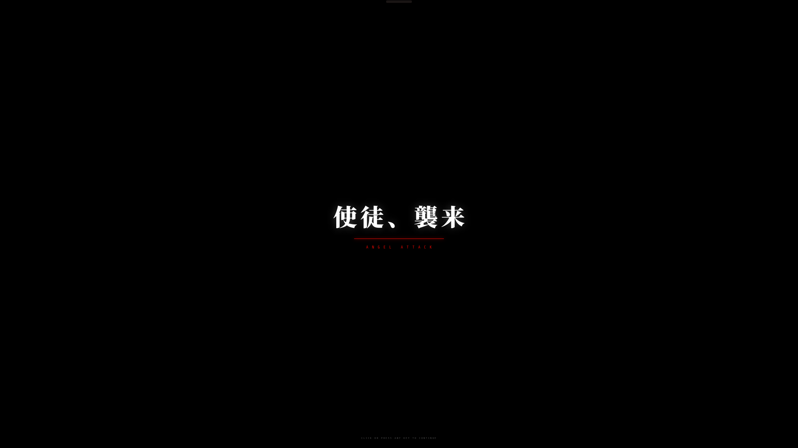

<p align="center">
  
</p>

<h1 align="center">MAGI Login System</h1>

<p align="center">
  Evangelion MAGI terminal login screen for SDDM
</p>

<p align="center">
  
  
  
  
</p>

---

## Screenshots

| Boot | Login | Granted | Denied |
|:----:|:-----:|:-------:|:------:|
|  |  |  |  |

> *"The MAGI system is a supercomputer that manages NERV... three systems, three personalities, three mothers."*

## Features

- **Animated hex reticle** — dual counter-rotating rings with pulsing core
- **MAGI stack status** — MELCHIOR / BALTHASAR / CASPER sync indicators
- **Terminal-style UI** — NERV branding, grid overlay, corner brackets
- **Clock panel** — real-time clock with CRT scanline effect
- **Emergency overlay** — red alert animation on failed login attempts
- **Session switcher** — keyboard-driven, no mouse required
- **Resolution-independent** — scales from 720p to 4K

## Install

### Automated

```bash
git clone https://github.com/DesmondZ01/sddm-magi.git
cd sddm-magi
sudo ./install.sh
```

### Manual

```bash
git clone https://github.com/DesmondZ01/sddm-magi.git
sudo cp -r sddm-magi /usr/share/sddm/themes/magi
echo -e "[Theme]\nCurrent=magi" | sudo tee /etc/sddm.conf.d/99-magi.conf
sudo systemctl restart sddm
```

## Requirements

| Package | Version |
|---------|---------|
| `sddm` | 0.21+ |
| `qt6-base` | 6.x |
| `qt6-declarative` | 6.x |

**Fonts** (bundled): Share Tech Mono, Saira Condensed (Bold, SemiBold)

## Configuration

Edit `/usr/share/sddm/themes/magi/theme.conf`:

```ini
[General]
background=          # Path to background image (leave empty for grid)
accentColor=#ffcc00  # Gold highlight
alertColor=#e10600   # Red alert
dataColor=#38a8ff    # Cyan data
```

## Project Structure

```
sddm-magi/
├── Main.qml                # Main theme file
├── metadata.desktop        # SDDM theme metadata
├── theme.conf              # Theme configuration
├── install.sh              # One-click installer
├── components/
│   ├── HexReticle.qml      # Animated hexagon rings
│   ├── MagiStack.qml       # MAGI system status
│   ├── ClockPanel.qml      # Clock with CRT effect
│   ├── BootLog.qml         # Boot log display
│   ├── Bracket.qml         # Corner brackets
│   ├── KanjiWatermark.qml  # Japanese kanji
│   ├── HazardStripes.qml   # Warning stripes
│   ├── Ruler.qml           # Measurement ruler
│   ├── SplashCard.qml      # Login card
│   └── EmergencyOverlay.qml # Alert animation
└── assets/
    ├── fonts/              # Bundled fonts
    └── scanlines.png       # CRT overlay
```

## Uninstall

```bash
sudo rm -rf /usr/share/sddm/themes/magi
sudo rm /etc/sddm.conf.d/99-magi.conf
sudo systemctl restart sddm
```

## Credits

- **Evangelion** — Hideaki Anno / Gainax / khara
- **NERV** — MAGI system design
- Fonts: [Share Tech Mono](https://fonts.google.com/specimen/Share+Tech+Mono), [Saira Condensed](https://fonts.google.com/specimen/Saira+Condensed)

## License

MIT
